# Flujo Completo de Registro de Usuario y Verificación de Email - Documentación Técnica Unificada

## 📋 Índice

1. [Visión General del Sistema](#-visión-general-del-sistema)
2. [Arquitectura y Componentes](#️-arquitectura-y-componentes)
3. [Flujo Completo Paso a Paso](#-flujo-completo-paso-a-paso)
4. [APIs y Endpoints](#-apis-y-endpoints)
5. [Validaciones Implementadas](#-validaciones-implementadas)
6. [Escenarios y Respuestas del Servidor](#-escenarios-y-respuestas-del-servidor)
7. [Componentes Frontend](#-componentes-frontend)
8. [Páginas de Estado](#-páginas-de-estado)
9. [Códigos de Implementación](#-códigos-de-implementación)
10. [Testing Comprehensivo](#-testing-comprehensivo)
11. [Configuración del Backend](#-configuración-del-backend)
12. [Consideraciones de Seguridad](#-consideraciones-de-seguridad)
13. [Diagramas de Flujo](#-diagramas-de-flujo)

---

## 🎯 Visión General del Sistema

El sistema de registro de usuario y verificación de email implementado sigue una **arquitectura Clean Architecture** con validación en múltiples capas y un flujo de verificación obligatoria antes del acceso completo al sistema.

### **Características Principales:**

- ✅ **Registro Seguro**: Validación completa de datos antes de crear usuario
- ✅ **Verificación Obligatoria**: Email debe ser verificado antes del primer login
- ✅ **Flujo Transaccional**: Email se envía ANTES de crear el usuario (v2.0)
- ✅ **Reenvío de Verificación**: Soporte para reenviar emails de verificación
- ✅ **Validación Multicapa**: Frontend + Backend + Base de datos
- ✅ **Manejo Exhaustivo de Errores**: Cobertura completa de casos edge
- ✅ **Clean Architecture**: Separación clara de responsabilidades
- ✅ **UX Optimizada**: Feedback inmediato y estados específicos

### **Flujo de Alto Nivel:**

```
Usuario se registra → Email enviado → Usuario verifica → Acceso completo
```

### **Evolución del Diseño (v2.0):**

En la versión 2.0, el flujo evolucionó para ser más seguro:

- **Antes**: Usuario creado → Email enviado (riesgo de usuarios sin verificar)
- **Ahora**: Email enviado → Usuario creado (solo si email envío exitoso)

---

## 🏗️ Arquitectura y Componentes

### **Estructura de Capas:**

```
src/
├── application/use-cases/auth/
│   ├── RegisterUseCase.ts                # Registro de usuario
│   ├── VerifyEmailUseCase.ts            # Verificación de email
│   └── ResendVerificationUseCase.ts     # Reenvío de verificación
├── domain/
│   ├── repositories/AuthRepository.ts   # Interface del repositorio
│   ├── services/validationService.ts    # Validaciones de formato
│   └── types/
│       ├── apiSchema.ts                 # Tipos de API
│       └── forms.ts                     # Tipos de formularios
├── infrastructure/api/
│   └── AuthApiRepository.ts             # Implementación HTTP
├── shared/constants/
│   ├── appRoutes.ts                     # Rutas de la aplicación
│   └── apiRoutes.ts                     # URLs de endpoints
└── ui/
    ├── pages/
    │   ├── RegisterPage.tsx             # Página de registro
    │   ├── EmailVerificationPage.tsx    # Procesamiento de verificación
    │   ├── EmailVerificationSentPage.tsx # Confirmación de envío
    │   ├── EmailVerificationSuccessPage.tsx # Éxito de verificación
    │   ├── EmailVerificationErrorPage.tsx # Error de verificación
    │   ├── EmailVerificationExpiredPage.tsx # Token expirado
    │   ├── EmailAlreadyVerifiedPage.tsx  # Ya verificado
    │   └── EmailVerificationResendPage.tsx # Reenvío
    └── components/Forms/
        └── RegisterForm.tsx              # Formulario de registro
```

### **Componentes Clave:**

1. **RegisterUseCase**
   - Orquesta el registro completo de usuario
   - Valida datos antes de enviar al repositorio
   - Maneja respuestas de éxito y error

2. **VerifyEmailUseCase**
   - Procesa la verificación de email con token
   - Maneja diferentes estados de verificación
   - Integra con el repositorio de autenticación

3. **ResendVerificationUseCase**
   - Permite reenviar emails de verificación
   - Valida que el usuario no esté ya verificado

4. **RegisterForm** 🔄 (Componente Principal)
   - Validación en tiempo real de formulario
   - Medidor de fuerza de contraseña
   - Throttling de envíos para evitar spam
   - Manejo de términos y condiciones

5. **EmailVerificationPage** 🔄 (Procesador)
   - Obtiene token desde URL path parameters
   - Procesa verificación automáticamente
   - Redirige según resultado de verificación

---

## 🔄 Flujo Completo Paso a Paso

### **PASO 1: Registro de Usuario**

**Ubicación**: Página de registro `/register`

#### **1.1 Validación de Formulario (Frontend)**

```typescript
// Validaciones en tiempo real
const validate = (values: RegisterFormData) => {
  const errors: Partial<Record<keyof RegisterFormData, string>> = {};

  if (!validateEmail(values.email)) {
    errors.email = t('errors.email.invalid');
  }
  if (!validateUsername(values.username)) {
    errors.username = t('errors.username.invalid');
  }
  if (!validatePassword(values.password)) {
    errors.password = t('errors.password.invalid');
  }
  if (values.password !== values.confirmPassword) {
    errors.confirmPassword = t('errors.password.mismatch');
  }
  if (!values.terms) {
    errors.terms = t('errors.terms.required');
  }

  return errors;
};
```

#### **1.2 Envío del Formulario**

```typescript
// Usuario completa formulario
const formData = {
  email: "usuario@ejemplo.com",
  username: "usuario123",
  password: "MiContraseña123!",
  confirmPassword: "MiContraseña123!",
  terms: true
};

// Petición al servidor
POST /api/auth/register
Content-Type: application/json

{
  "email": "usuario@ejemplo.com",
  "username": "usuario123",
  "password": "MiContraseña123!"
}
```

#### **1.3 Respuestas Esperadas**

```typescript
// ✅ Registro exitoso (usuario creado y email enviado)
{
  "success": true,
  "data": {
    "id": "user_123456",
    "email": "usuario@ejemplo.com",
    "username": "usuario123",
    "role": "user",
    "createdAt": "2024-01-15T10:30:00.000Z",
    "updatedAt": "2024-01-15T10:30:00.000Z"
  },
  "status": 201,
  "code": "SUCCESS",
  "message": "User registered successfully. Check your email to verify your account.",
  "timestamp": "2024-01-15T10:30:00.000Z",
  "requestId": "550e8400-e29b-41d4-a716-446655440000"
}

// ❌ Email ya existe
{
  "success": false,
  "data": null,
  "status": 409,
  "code": "AUTH_EMAIL_ALREADY_EXISTS",
  "message": "The email is already registered",
  "timestamp": "2024-01-15T10:30:00.000Z",
  "requestId": "550e8400-e29b-41d4-a716-446655440000",
  "error": {
    "type": "business",
    "details": [
      {
        "field": "email",
        "code": "DUPLICATE",
        "message": "This email is already in use"
      }
    ]
  }
}

// ❌ Username ya existe
{
  "success": false,
  "data": null,
  "status": 409,
  "code": "AUTH_USER_ALREADY_EXISTS",
  "message": "The username is already registered",
  "timestamp": "2024-01-15T10:30:00.000Z",
  "requestId": "550e8400-e29b-41d4-a716-446655440000",
  "error": {
    "type": "business",
    "details": [
      {
        "field": "username",
        "code": "DUPLICATE",
        "message": "This username is already in use"
      }
    ]
  }
}

// ❌ Validación de datos
{
  "success": false,
  "data": null,
  "status": 422,
  "code": "VALIDATION_ERROR",
  "message": "The submitted data is not valid",
  "timestamp": "2024-01-15T10:30:00.000Z",
  "requestId": "550e8400-e29b-41d4-a716-446655440000",
  "error": {
    "type": "validation",
    "details": [
      {
        "field": "email",
        "code": "INVALID_FORMAT",
        "message": "The email format is not valid"
      },
      {
        "field": "password",
        "code": "TOO_WEAK",
        "message": "Password must contain at least one uppercase letter, one lowercase letter, one number and one special character"
      }
    ]
  }
}

// ❌ Servicio de email no disponible (v2.0)
{
  "success": false,
  "data": null,
  "status": 503,
  "code": "SERVICE_UNAVAILABLE",
  "message": "Registration failed: Unable to send verification email. Please try again later.",
  "timestamp": "2024-01-15T10:30:00.000Z",
  "requestId": "550e8400-e29b-41d4-a716-446655440000",
  "error": {
    "type": "server",
    "details": [
      {
        "field": "email_service",
        "code": "SERVICE_UNAVAILABLE",
        "message": "Email service is temporarily unavailable"
      }
    ]
  }
}
```

**Acción frontend**: Si el registro es exitoso, redirigir a `EmailVerificationSentPage`

### **PASO 2: Confirmación de Envío de Email**

**Página**: `EmailVerificationSentPage.tsx`
**Ruta**: `/verify-email-sent`

**Contenido mostrado**:

- Mensaje de confirmación de registro
- Instrucciones para revisar email
- Enlace para reenviar email de verificación
- Enlace para cambiar email (opcional)

### **PASO 3: Usuario Recibe Email y Hace Click**

**URL del Email de Verificación:**

```
https://miapp.com/verify-email/eyJhbGciOiJIUzI1NiIsInR5cCI6IkpXVCJ9...
```

**Estructura:**

- Base: `https://miapp.com/verify-email/`
- Token: `eyJhbGciOiJIUzI1NiIsInR5cCI6IkpXVCJ9...` (JWT con información del usuario)

**Router Configuration:**

```typescript
<Route path="/verify-email/:token" element={<EmailVerificationPage />} />
```

### **PASO 4: Procesamiento de Verificación**

**Página**: `EmailVerificationPage.tsx`
**Ruta**: `/verify-email/:token`

#### **4.1 Extracción del Token**

```typescript
// En EmailVerificationPage.tsx
const params = useParams();
const token = params.token;

if (!token) {
  navigate(APP_ROUTES.VERIFY_EMAIL_EXPIRED);
  return;
}
```

#### **4.2 Petición de Verificación**

```http
GET /api/auth/verify-email/eyJhbGciOiJIUzI1NiIsInR5cCI6IkpXVCJ9...
Content-Type: application/json
```

#### **4.3 Respuestas del Servidor**

```typescript
// ✅ Verificación exitosa
{
  "success": true,
  "data": {
    "id": "user_123456",
    "email": "usuario@ejemplo.com",
    "username": "usuario123",
    "role": "user",
    "createdAt": "2024-01-15T10:30:00.000Z",
    "updatedAt": "2024-01-15T10:30:00.000Z"
  },
  "status": 200,
  "code": "SUCCESS",
  "message": "Email verified successfully",
  "timestamp": "2024-01-15T10:30:00.000Z",
  "requestId": "550e8400-e29b-41d4-a716-446655440000"
}

// ❌ Token expirado
{
  "success": false,
  "data": null,
  "status": 401,
  "code": "AUTH_TOKEN_EXPIRED",
  "message": "Verification token has expired",
  "timestamp": "2024-01-15T10:30:00.000Z",
  "requestId": "550e8400-e29b-41d4-a716-446655440000",
  "error": {
    "type": "business",
    "details": [
      {
        "field": "token",
        "code": "EXPIRED",
        "message": "Verification token has expired"
      }
    ]
  }
}

// ❌ Usuario ya verificado
{
  "success": false,
  "data": null,
  "status": 409,
  "code": "AUTH_USER_ALREADY_VERIFIED",
  "message": "This account has already been verified",
  "timestamp": "2024-01-15T10:30:00.000Z",
  "requestId": "550e8400-e29b-41d4-a716-446655440000",
  "error": {
    "type": "business",
    "details": [
      {
        "field": "user",
        "code": "ALREADY_VERIFIED",
        "message": "The user is already verified"
      }
    ]
  }
}

// ❌ Token inválido o no encontrado
{
  "success": false,
  "data": null,
  "status": 401,
  "code": "AUTH_TOKEN_INVALID",
  "message": "Invalid verification token",
  "timestamp": "2024-01-15T10:30:00.000Z",
  "requestId": "550e8400-e29b-41d4-a716-446655440000",
  "error": {
    "type": "business",
    "details": [
      {
        "field": "token",
        "code": "INVALID",
        "message": "Invalid verification token"
      }
    ]
  }
}

// ❌ Error actualizando base de datos
{
  "success": false,
  "data": null,
  "status": 500,
  "code": "AUTH_UPDATE_FAILED",
  "message": "Error updating verification status",
  "timestamp": "2024-01-15T10:30:00.000Z",
  "requestId": "550e8400-e29b-41d4-a716-446655440000",
  "error": {
    "type": "server",
    "details": [
      {
        "field": "database",
        "code": "UPDATE_FAILED",
        "message": "Could not update the database"
      }
    ]
  }
}
```

#### **4.4 Lógica de Redirección**

```typescript
// En EmailVerificationPage.tsx
useEffect(() => {
  if (!loading && verificationStatus) {
    switch (verificationStatus) {
      case ApiSuccessCodes.SUCCESS:
        navigate(APP_ROUTES.VERIFY_EMAIL_SUCCESS);
        break;
      case ApiErrorCodes.AUTH_TOKEN_EXPIRED:
        navigate(APP_ROUTES.VERIFY_EMAIL_EXPIRED);
        break;
      case ApiErrorCodes.AUTH_USER_ALREADY_VERIFIED:
        navigate(APP_ROUTES.VERIFY_EMAIL_ALREADY_VERIFIED);
        break;
      case ApiErrorCodes.AUTH_UPDATE_FAILED:
        navigate(APP_ROUTES.VERIFY_EMAIL_ERROR);
        break;
      case ApiErrorCodes.AUTH_TOKEN_INVALID:
      default:
        navigate(APP_ROUTES.VERIFY_EMAIL_ERROR);
        break;
    }
  }
}, [loading, verificationStatus, navigate]);
```

### **PASO 5: Reenvío de Verificación** (Flujo Opcional)

**Ubicación**: Desde `EmailVerificationSentPage` o página específica
**Ruta**: `/verify-email-resend`

#### **5.1 Solicitud de Reenvío**

```typescript
// Petición al servidor
POST /api/auth/verify-email-resend
Content-Type: application/json

{
  "identifier": "usuario@ejemplo.com"
}
```

#### **5.2 Respuestas del Reenvío**

```typescript
// ✅ Reenvío exitoso
{
  "success": true,
  "data": null,
  "status": 200,
  "code": "SUCCESS",
  "message": "New link sent. Check your inbox.",
  "timestamp": "2024-01-15T10:30:00.000Z",
  "requestId": "550e8400-e29b-41d4-a716-446655440000"
}

// ❌ Usuario ya verificado
{
  "success": false,
  "data": null,
  "status": 400,
  "code": "AUTH_USER_ALREADY_VERIFIED",
  "message": "User already verified",
  "timestamp": "2024-01-15T10:30:00.000Z",
  "requestId": "550e8400-e29b-41d4-a716-446655440000",
  "error": {
    "type": "business",
    "details": [
      {
        "field": "user",
        "code": "ALREADY_VERIFIED",
        "message": "User already verified"
      }
    ]
  }
}

// ❌ Usuario no encontrado
{
  "success": false,
  "data": null,
  "status": 404,
  "code": "AUTH_USER_NOT_FOUND",
  "message": "User not found",
  "timestamp": "2024-01-15T10:30:00.000Z",
  "requestId": "550e8400-e29b-41d4-a716-446655440000",
  "error": {
    "type": "business",
    "details": [
      {
        "field": "user",
        "code": "NOT_FOUND",
        "message": "User not found"
      }
    ]
  }
}
```

### **PASO 6: Finalización del Proceso**

Según el resultado de la verificación, el usuario es redirigido a:

- **✅ Éxito**: `EmailVerificationSuccessPage` → Puede hacer login
- **❌ Token expirado**: `EmailVerificationExpiredPage` → Puede solicitar reenvío
- **❌ Ya verificado**: `EmailAlreadyVerifiedPage` → Puede hacer login
- **❌ Error general**: `EmailVerificationErrorPage` → Puede contactar soporte

---

## 🔗 APIs y Endpoints

### **Resumen de Endpoints**

| Método | Endpoint                     | Propósito                   | Autenticación |
| ------ | ---------------------------- | --------------------------- | ------------- |
| `POST` | `/auth/register`             | Registrar nuevo usuario     | No            |
| `GET`  | `/auth/verify-email/{token}` | Verificar email con token   | No            |
| `POST` | `/auth/verify-email-resend`  | Reenviar email verificación | No            |

### **Definiciones en Código**

```typescript
// src/shared/constants/apiRoutes.ts
export const API_ROUTES = {
  AUTH: {
    REGISTER: '/auth/register',
    VERIFY_EMAIL: '/auth/verify-email/:token',
    VERIFY_EMAIL_RESEND: '/auth/verify-email-resend',
  },
};

// Funciones auxiliares
export const getAuthVerifyEmailUrl = (token: string): string =>
  API_ROUTES.AUTH.VERIFY_EMAIL.replace(':token', token);
```

### **Implementación en Repository**

```typescript
// src/infrastructure/api/AuthApiRepository.ts
export class AuthApiRepository implements IAuthRepository {
  async register(payload: RegisterPayload): ApiPromise<User> {
    try {
      const response = await api.post(API_ROUTES.AUTH.REGISTER, {
        email: payload.email,
        username: payload.username,
        password: payload.password,
      });
      return handleApiSuccess({ response });
    } catch (error) {
      return handleApiError(error);
    }
  }

  async verifyEmail(payload: VerifyEmailPayload): ApiPromise<EmailVerificationResponse> {
    try {
      const response = await api.get(getAuthVerifyEmailUrl(payload.token));
      return handleApiSuccess({ response });
    } catch (error) {
      return handleApiError(error);
    }
  }

  async resendVerification(payload: ResendVerificationPayload): ApiPromise<void> {
    try {
      const response = await api.post(API_ROUTES.AUTH.VERIFY_EMAIL_RESEND, {
        identifier: payload.identifier,
      });
      return handleApiSuccess({ response });
    } catch (error) {
      return handleApiError(error);
    }
  }
}
```

---

## ✅ Validaciones Implementadas

### **1. Validación de Email (Frontend)**

```typescript
// src/domain/services/validationService.ts
export const validateEmail = (email: string): boolean => {
  const emailRegex = /^[^\s@]+@[^\s@]+\.[^\s@]+$/;
  return emailRegex.test(email);
};
```

**Criterios:**

- Formato válido de email
- No espacios en blanco
- Contiene @ y dominio válido

### **2. Validación de Username (Frontend)**

```typescript
export const validateUsername = (username: string): boolean => {
  if (!username || username.length < 3 || username.length > 30) {
    return false;
  }
  const usernameRegex = /^[a-zA-Z0-9_-]+$/;
  return usernameRegex.test(username);
};
```

**Criterios:**

- Entre 3 y 30 caracteres
- Solo letras, números, guiones y guiones bajos
- No espacios ni caracteres especiales

### **3. Validación de Contraseña (Frontend)**

```typescript
export const validatePassword = (password: string): boolean => {
  if (!password || password.length < 8) {
    return false;
  }
  const hasUpperCase = /[A-Z]/.test(password);
  const hasLowerCase = /[a-z]/.test(password);
  const hasNumbers = /\d/.test(password);
  const hasSpecialChar = /[!@#$%^&*(),.?":{}|<>]/.test(password);

  return hasUpperCase && hasLowerCase && hasNumbers && hasSpecialChar;
};
```

**Criterios:**

- Mínimo 8 caracteres
- Al menos una mayúscula
- Al menos una minúscula
- Al menos un número
- Al menos un carácter especial

### **4. Validaciones del Backend** (Esperadas)

1. **Unicidad de Email**:

   ```sql
   SELECT COUNT(*) FROM users WHERE email = ?
   ```

2. **Unicidad de Username**:

   ```sql
   SELECT COUNT(*) FROM users WHERE username = ?
   ```

3. **Complejidad de Contraseña**:
   - Mismos criterios que frontend
   - Hash seguro con bcrypt/argon2

4. **Validación de Token de Verificación**:
   - Token válido (JWT)
   - No expirado
   - Usuario existe
   - Usuario no verificado previamente

---

## 🎭 Escenarios y Respuestas del Servidor

### **Matriz de Escenarios de Registro**

| Escenario              | Validación Frontend | Petición Backend | Respuesta Backend         | Resultado Frontend            |
| ---------------------- | ------------------- | ---------------- | ------------------------- | ----------------------------- |
| Datos válidos y únicos | ✅ Pass             | POST /register   | `201 SUCCESS`             | → `EmailVerificationSentPage` |
| Email ya existe        | ✅ Pass             | POST /register   | `409 EMAIL_EXISTS`        | Mostrar error en formulario   |
| Username ya existe     | ✅ Pass             | POST /register   | `409 USER_EXISTS`         | Mostrar error en formulario   |
| Email formato inválido | ❌ Fail             | No se envía      | N/A                       | Mostrar error en formulario   |
| Contraseña débil       | ❌ Fail             | No se envía      | N/A                       | Mostrar error en formulario   |
| Servicio email caído   | ✅ Pass             | POST /register   | `503 SERVICE_UNAVAILABLE` | Mostrar mensaje de reintento  |
| Error de base de datos | ✅ Pass             | POST /register   | `500 DATABASE_ERROR`      | Mostrar error genérico        |

### **Matriz de Escenarios de Verificación**

| Escenario              | Token URL   | Petición Backend | Respuesta Backend      | Resultado Frontend               |
| ---------------------- | ----------- | ---------------- | ---------------------- | -------------------------------- |
| Token válido y activo  | ✅ Presente | GET /verify      | `200 SUCCESS`          | → `EmailVerificationSuccessPage` |
| Token expirado         | ✅ Presente | GET /verify      | `401 TOKEN_EXPIRED`    | → `EmailVerificationExpiredPage` |
| Token inválido         | ✅ Presente | GET /verify      | `401 TOKEN_INVALID`    | → `EmailVerificationErrorPage`   |
| Token no en URL        | ❌ Ausente  | No se envía      | N/A                    | → `EmailVerificationExpiredPage` |
| Usuario ya verificado  | ✅ Presente | GET /verify      | `409 ALREADY_VERIFIED` | → `EmailAlreadyVerifiedPage`     |
| Error actualización BD | ✅ Presente | GET /verify      | `500 UPDATE_FAILED`    | → `EmailVerificationErrorPage`   |

### **Códigos de Estado HTTP**

#### **POST /auth/register**

- `201` - Usuario registrado exitosamente
- `409` - Email o username ya existe
- `422` - Datos de entrada inválidos
- `503` - Servicio de email no disponible
- `500` - Error de base de datos

#### **GET /auth/verify-email/{token}**

- `200` - Email verificado exitosamente
- `400` - Token formato inválido
- `401` - Token expirado o no encontrado
- `409` - Usuario ya verificado
- `500` - Error actualizando base de datos

#### **POST /auth/verify-email-resend**

- `200` - Email reenviado exitosamente
- `400` - Usuario ya verificado
- `404` - Usuario no encontrado
- `503` - Servicio de email no disponible
- `500` - Error de base de datos

---

## 🎨 Componentes Frontend

### **Estados del Formulario de Registro**

```typescript
// src/ui/components/Forms/RegisterForm.tsx
type FormState =
  | 'idle' // Formulario listo para usar
  | 'validating' // Validando campos en tiempo real
  | 'submitting' // Enviando datos al servidor
  | 'throttled' // Esperando por throttling
  | 'success' // Registro exitoso
  | 'error'; // Error en el proceso

interface RegisterFormData {
  email: string;
  username: string;
  password: string;
  confirmPassword: string;
  terms: boolean;
}
```

### **Características del RegisterForm**

1. **Validación en Tiempo Real**:

   ```typescript
   const validate = useCallback(
     (values: RegisterFormData) => {
       const errors: Partial<Record<keyof RegisterFormData, string>> = {};
       // Validaciones...
       return errors;
     },
     [t]
   );
   ```

2. **Medidor de Fuerza de Contraseña**:

   ```typescript
   <PasswordStrengthMeter
     password={values.password}
     showRequirements={true}
   />
   ```

3. **Throttling de Envíos**:

   ```typescript
   const { isThrottled, timeUntilNextSubmission, remainingAttempts } = useForm<RegisterFormData>({
     // configuración...
   });
   ```

4. **Términos y Condiciones**:
   ```typescript
   <Form.Check
     type="checkbox"
     id="terms"
     name="terms"
     checked={values.terms}
     onChange={handleCheckboxChange}
     label={
       <Trans
         i18nKey="register.terms_label"
         components={{
           link: <button type="button" onClick={handleShow} />,
         }}
       />
     }
   />
   ```

### **Estados de EmailVerificationPage**

```typescript
// src/ui/pages/EmailVerificationPage.tsx
type VerificationState =
  | 'loading' // Procesando token
  | 'success' // Verificación exitosa
  | 'expired' // Token expirado
  | 'invalid' // Token inválido
  | 'already_verified' // Usuario ya verificado
  | 'update_failed' // Error actualizando BD
  | 'network_error'; // Error de red

const [loading, setLoading] = useState(true);
const [verificationStatus, setVerificationStatus] = useState<string | null>(null);
```

---

## 📄 Páginas de Estado

### **1. RegisterPage.tsx**

- **Ruta**: `/register`
- **Propósito**: Mostrar formulario de registro
- **Contenido**: `RegisterForm` con validaciones

### **2. EmailVerificationSentPage.tsx**

- **Ruta**: `/verify-email-sent`
- **Propósito**: Confirmar que email fue enviado
- **Contenido**:
  - Mensaje de confirmación
  - Instrucciones para revisar email
  - Enlace para reenviar verificación

### **3. EmailVerificationPage.tsx**

- **Ruta**: `/verify-email/:token`
- **Propósito**: Procesar verificación automáticamente
- **Estados**: Loading → Redirect según resultado

### **4. EmailVerificationSuccessPage.tsx**

- **Ruta**: `/verify-email-success`
- **Propósito**: Confirmar verificación exitosa
- **Contenido**:
  - Mensaje de éxito
  - Enlace para hacer login
  - Información sobre acceso completo

### **5. EmailVerificationErrorPage.tsx**

- **Ruta**: `/verify-email-error`
- **Propósito**: Errores de verificación general
- **Casos**:
  - Token inválido
  - Error de base de datos
  - Errores de red

### **6. EmailVerificationExpiredPage.tsx**

- **Ruta**: `/verify-email-expired`
- **Propósito**: Token expirado específicamente
- **Contenido**:
  - Mensaje explicativo
  - Enlace para reenviar verificación
  - Información sobre expiración

### **7. EmailAlreadyVerifiedPage.tsx**

- **Ruta**: `/verify-email-already-verified`
- **Propósito**: Usuario ya verificado
- **Contenido**:
  - Mensaje informativo
  - Enlace para hacer login
  - Recordatorio de que ya tiene acceso

### **8. EmailVerificationResendPage.tsx**

- **Ruta**: `/verify-email-resend`
- **Propósito**: Reenviar email de verificación
- **Contenido**:
  - Formulario con email
  - Botón para reenviar
  - Información sobre límites de reenvío

---

## 💻 Códigos de Implementación

### **Tipos TypeScript**

```typescript
// src/domain/types/apiSchema.ts
export interface RegisterPayload {
  email: string;
  username: string;
  password: string;
}

export interface VerifyEmailPayload {
  token: string;
}

export interface EmailVerificationResponse {
  status: string;
  message: string;
  resendRequired?: boolean;
}

export interface ResendVerificationPayload {
  identifier: string;
}

// src/domain/types/forms.ts
export interface RegisterFormData {
  email: string;
  username: string;
  password: string;
  confirmPassword: string;
  terms: boolean;
}
```

### **Casos de Uso**

```typescript
// src/application/use-cases/auth/RegisterUseCase.ts
export class RegisterUseCase {
  constructor(private readonly authRepository: IAuthRepository) {}

  async execute(payload: RegisterPayload): ApiPromise<User> {
    return await this.authRepository.register(payload);
  }
}

// src/application/use-cases/auth/VerifyEmailUseCase.ts
export class VerifyEmailUseCase {
  constructor(private readonly authRepository: IAuthRepository) {}

  async execute(payload: VerifyEmailPayload): ApiPromise<EmailVerificationResponse> {
    return await this.authRepository.verifyEmail(payload);
  }
}

// src/application/use-cases/auth/ResendVerificationUseCase.ts
export class ResendVerificationUseCase {
  constructor(private readonly authRepository: IAuthRepository) {}

  async execute(payload: ResendVerificationPayload): ApiPromise<void> {
    return await this.authRepository.resendVerification(payload);
  }
}
```

### **Repository Interface**

```typescript
// src/domain/repositories/AuthRepository.ts
export interface IAuthRepository extends Repository<User> {
  register(payload: RegisterPayload): ApiPromise<User>;
  verifyEmail(payload: VerifyEmailPayload): ApiPromise<EmailVerificationResponse>;
  resendVerification(payload: ResendVerificationPayload): ApiPromise<void>;
}
```

### **Hook de Autenticación**

```typescript
// src/ui/hooks/useAuth.ts
export const useAuth = () => {
  const dispatch = useAppDispatch();
  const { user, loading } = useAppSelector(state => state.auth);

  const register = useCallback(
    async (payload: RegisterPayload) => {
      try {
        dispatch(setLoading(true));
        const authRepository = new AuthApiRepository();
        const registerUseCase = new RegisterUseCase(authRepository);

        const response = await registerUseCase.execute(payload);

        if (response.success) {
          // Registro exitoso - usuario debe verificar email
          return { success: true, data: response.data };
        } else {
          return { success: false, error: response.message };
        }
      } catch (error) {
        return { success: false, error: 'Registration failed' };
      } finally {
        dispatch(setLoading(false));
      }
    },
    [dispatch]
  );

  return {
    user,
    loading,
    register,
    // ... otros métodos
  };
};
```

---

## 🧪 Testing Comprehensivo

### **Tests del RegisterForm**

```typescript
describe('RegisterForm', () => {
  it('should validate email format in real time', async () => {
    render(<RegisterForm />);

    const emailInput = screen.getByLabelText(/email/i);
    await userEvent.type(emailInput, 'invalid-email');

    await waitFor(() => {
      expect(screen.getByText(/email format is not valid/i)).toBeInTheDocument();
    });
  });

  it('should show password strength meter', () => {
    render(<RegisterForm />);

    const passwordInput = screen.getByLabelText(/password/i);
    const strengthMeter = screen.getByTestId('password-strength-meter');

    expect(passwordInput).toBeInTheDocument();
    expect(strengthMeter).toBeInTheDocument();
  });

  it('should enforce terms and conditions acceptance', async () => {
    render(<RegisterForm />);

    // Completar todos los campos excepto términos
    await userEvent.type(screen.getByLabelText(/email/i), 'test@example.com');
    await userEvent.type(screen.getByLabelText(/username/i), 'testuser');
    await userEvent.type(screen.getByLabelText(/^password/i), 'Password123!');
    await userEvent.type(screen.getByLabelText(/confirm/i), 'Password123!');

    const submitButton = screen.getByRole('button', { name: /register/i });
    await userEvent.click(submitButton);

    await waitFor(() => {
      expect(screen.getByText(/terms acceptance is required/i)).toBeInTheDocument();
    });
  });

  it('should handle successful registration', async () => {
    const mockRegister = jest.fn().mockResolvedValue({
      success: true,
      data: { id: '123', email: 'test@example.com' }
    });

    jest.spyOn(require('@ui/hooks/useAuth'), 'useAuth').mockReturnValue({
      register: mockRegister,
      loading: false,
    });

    const mockOnSuccess = jest.fn();
    render(<RegisterForm onSuccess={mockOnSuccess} />);

    // Completar formulario correctamente
    await userEvent.type(screen.getByLabelText(/email/i), 'test@example.com');
    await userEvent.type(screen.getByLabelText(/username/i), 'testuser');
    await userEvent.type(screen.getByLabelText(/^password/i), 'Password123!');
    await userEvent.type(screen.getByLabelText(/confirm/i), 'Password123!');
    await userEvent.click(screen.getByLabelText(/terms/i));

    const submitButton = screen.getByRole('button', { name: /register/i });
    await userEvent.click(submitButton);

    await waitFor(() => {
      expect(mockRegister).toHaveBeenCalledWith({
        email: 'test@example.com',
        username: 'testuser',
        password: 'Password123!'
      });
      expect(mockOnSuccess).toHaveBeenCalled();
    });
  });
});
```

### **Tests de EmailVerificationPage**

```typescript
describe('EmailVerificationPage', () => {
  it('should redirect to expired page when no token provided', () => {
    const router = createMemoryRouter([
      { path: '/verify-email', element: <EmailVerificationPage /> },
    ], {
      initialEntries: ['/verify-email'],
    });

    render(<RouterProvider router={router} />);

    expect(mockNavigate).toHaveBeenCalledWith(APP_ROUTES.VERIFY_EMAIL_EXPIRED);
  });

  it('should process token and redirect to success page', async () => {
    const mockVerifyEmail = jest.fn().mockResolvedValue({
      success: true,
      data: { status: 'SUCCESS' }
    });

    jest.spyOn(require('@application/use-cases/auth/VerifyEmailUseCase'), 'VerifyEmailUseCase')
      .mockImplementation(() => ({ execute: mockVerifyEmail }));

    const router = createMemoryRouter([
      { path: '/verify-email/:token', element: <EmailVerificationPage /> },
    ], {
      initialEntries: ['/verify-email/valid-token'],
    });

    render(<RouterProvider router={router} />);

    await waitFor(() => {
      expect(mockVerifyEmail).toHaveBeenCalledWith({ token: 'valid-token' });
      expect(mockNavigate).toHaveBeenCalledWith(APP_ROUTES.VERIFY_EMAIL_SUCCESS);
    });
  });

  it('should handle expired token correctly', async () => {
    const mockVerifyEmail = jest.fn().mockResolvedValue({
      success: false,
      code: 'AUTH_TOKEN_EXPIRED'
    });

    jest.spyOn(require('@application/use-cases/auth/VerifyEmailUseCase'), 'VerifyEmailUseCase')
      .mockImplementation(() => ({ execute: mockVerifyEmail }));

    const router = createMemoryRouter([
      { path: '/verify-email/:token', element: <EmailVerificationPage /> },
    ], {
      initialEntries: ['/verify-email/expired-token'],
    });

    render(<RouterProvider router={router} />);

    await waitFor(() => {
      expect(mockNavigate).toHaveBeenCalledWith(APP_ROUTES.VERIFY_EMAIL_EXPIRED);
    });
  });
});
```

### **Tests de Integración**

```typescript
describe('Complete Registration Flow', () => {
  it('should complete full flow from registration to email verification', async () => {
    // 1. Mock successful registration
    const mockRegister = jest.fn().mockResolvedValue({
      success: true,
      data: { id: '123', email: 'test@example.com' }
    });

    // 2. Mock successful verification
    const mockVerifyEmail = jest.fn().mockResolvedValue({
      success: true,
      data: { status: 'SUCCESS' }
    });

    jest.spyOn(require('@ui/hooks/useAuth'), 'useAuth').mockReturnValue({
      register: mockRegister,
      loading: false,
    });

    jest.spyOn(require('@application/use-cases/auth/VerifyEmailUseCase'), 'VerifyEmailUseCase')
      .mockImplementation(() => ({ execute: mockVerifyEmail }));

    // 3. Simulate registration
    render(<RegisterForm />);

    await userEvent.type(screen.getByLabelText(/email/i), 'test@example.com');
    await userEvent.type(screen.getByLabelText(/username/i), 'testuser');
    await userEvent.type(screen.getByLabelText(/^password/i), 'Password123!');
    await userEvent.type(screen.getByLabelText(/confirm/i), 'Password123!');
    await userEvent.click(screen.getByLabelText(/terms/i));
    await userEvent.click(screen.getByRole('button', { name: /register/i }));

    // 4. Verify registration was called
    await waitFor(() => {
      expect(mockRegister).toHaveBeenCalled();
    });

    // 5. Simulate clicking verification link
    const router = createMemoryRouter([
      { path: '/verify-email/:token', element: <EmailVerificationPage /> },
    ], {
      initialEntries: ['/verify-email/verification-token'],
    });

    render(<RouterProvider router={router} />);

    // 6. Verify email verification was called
    await waitFor(() => {
      expect(mockVerifyEmail).toHaveBeenCalledWith({ token: 'verification-token' });
      expect(mockNavigate).toHaveBeenCalledWith(APP_ROUTES.VERIFY_EMAIL_SUCCESS);
    });
  });
});
```

---

## 🔧 Configuración del Backend

### **Base de Datos**

```sql
-- Tabla de usuarios con campos de verificación
CREATE TABLE users (
  id SERIAL PRIMARY KEY,
  email VARCHAR(255) UNIQUE NOT NULL,
  username VARCHAR(50) UNIQUE NOT NULL,
  password_hash VARCHAR(255) NOT NULL,
  email_verified BOOLEAN DEFAULT FALSE,
  email_verification_token VARCHAR(500) NULL,
  email_verification_expires TIMESTAMP NULL,
  created_at TIMESTAMP DEFAULT NOW(),
  updated_at TIMESTAMP DEFAULT NOW()
);

-- Índices para búsquedas optimizadas
CREATE INDEX idx_users_email ON users(email);
CREATE INDEX idx_users_username ON users(username);
CREATE INDEX idx_users_verification_token ON users(email_verification_token);
CREATE INDEX idx_users_email_verified ON users(email_verified);
```

### **Endpoints del Backend**

```javascript
// POST /auth/register
app.post('/auth/register', async (req, res) => {
  const { email, username, password } = req.body;

  try {
    // 1. Validar datos de entrada
    const validationErrors = validateRegistrationData({ email, username, password });
    if (validationErrors.length > 0) {
      return res.status(422).json({
        success: false,
        data: null,
        status: 422,
        code: 'VALIDATION_ERROR',
        message: 'The submitted data is not valid',
        timestamp: new Date().toISOString(),
        requestId: generateRequestId(),
        error: {
          type: 'validation',
          details: validationErrors,
        },
      });
    }

    // 2. Verificar unicidad
    const existingUser = await User.findOne({
      $or: [{ email }, { username }],
    });

    if (existingUser) {
      const field = existingUser.email === email ? 'email' : 'username';
      const code = field === 'email' ? 'AUTH_EMAIL_ALREADY_EXISTS' : 'AUTH_USER_ALREADY_EXISTS';

      return res.status(409).json({
        success: false,
        data: null,
        status: 409,
        code,
        message: `The ${field} is already registered`,
        timestamp: new Date().toISOString(),
        requestId: generateRequestId(),
        error: {
          type: 'business',
          details: [
            {
              field,
              code: 'DUPLICATE',
              message: `This ${field} is already in use`,
            },
          ],
        },
      });
    }

    // 3. Generar token de verificación
    const verificationToken = jwt.sign(
      { email, type: 'email-verification' },
      process.env.JWT_SECRET,
      { expiresIn: '24h' }
    );

    // 4. Intentar enviar email ANTES de crear usuario (v2.0)
    try {
      await sendVerificationEmail(email, verificationToken);
    } catch (emailError) {
      return res.status(503).json({
        success: false,
        data: null,
        status: 503,
        code: 'SERVICE_UNAVAILABLE',
        message: 'Registration failed: Unable to send verification email. Please try again later.',
        timestamp: new Date().toISOString(),
        requestId: generateRequestId(),
        error: {
          type: 'server',
          details: [
            {
              field: 'email_service',
              code: 'SERVICE_UNAVAILABLE',
              message: 'Email service is temporarily unavailable',
            },
          ],
        },
      });
    }

    // 5. Crear usuario solo si email fue enviado exitosamente
    const hashedPassword = await bcrypt.hash(password, 12);
    const newUser = await User.create({
      email,
      username,
      password_hash: hashedPassword,
      email_verified: false,
      email_verification_token: verificationToken,
      email_verification_expires: new Date(Date.now() + 24 * 60 * 60 * 1000), // 24 horas
    });

    // 6. Respuesta exitosa
    res.status(201).json({
      success: true,
      data: {
        id: newUser.id,
        email: newUser.email,
        username: newUser.username,
        role: 'user',
        createdAt: newUser.created_at,
        updatedAt: newUser.updated_at,
      },
      status: 201,
      code: 'SUCCESS',
      message: 'User registered successfully. Check your email to verify your account.',
      timestamp: new Date().toISOString(),
      requestId: generateRequestId(),
    });
  } catch (error) {
    res.status(500).json({
      success: false,
      data: null,
      status: 500,
      code: 'DATABASE_ERROR',
      message: 'Database operation failed',
      timestamp: new Date().toISOString(),
      requestId: generateRequestId(),
      error: {
        type: 'server',
        details: [
          {
            field: 'database',
            code: 'DATABASE_ERROR',
            message: 'Database connection or operation failed',
          },
        ],
      },
    });
  }
});

// GET /auth/verify-email/:token
app.get('/auth/verify-email/:token', async (req, res) => {
  const { token } = req.params;

  try {
    // 1. Verificar formato del JWT
    let decoded;
    try {
      decoded = jwt.verify(token, process.env.JWT_SECRET);
    } catch (jwtError) {
      return res.status(400).json({
        success: false,
        data: null,
        status: 400,
        code: 'AUTH_TOKEN_INVALID',
        message: 'Invalid verification token',
        timestamp: new Date().toISOString(),
        requestId: generateRequestId(),
        error: {
          type: 'business',
          details: [
            {
              field: 'token',
              code: 'INVALID',
              message: 'Invalid verification token',
            },
          ],
        },
      });
    }

    // 2. Buscar usuario con este token
    const user = await User.findOne({
      email_verification_token: token,
      email: decoded.email,
    });

    if (!user) {
      return res.status(401).json({
        success: false,
        data: null,
        status: 401,
        code: 'AUTH_TOKEN_INVALID',
        message: 'Invalid verification token',
        timestamp: new Date().toISOString(),
        requestId: generateRequestId(),
        error: {
          type: 'business',
          details: [
            {
              field: 'token',
              code: 'INVALID',
              message: 'Invalid verification token',
            },
          ],
        },
      });
    }

    // 3. Verificar si ya está verificado
    if (user.email_verified) {
      return res.status(409).json({
        success: false,
        data: null,
        status: 409,
        code: 'AUTH_USER_ALREADY_VERIFIED',
        message: 'This account has already been verified',
        timestamp: new Date().toISOString(),
        requestId: generateRequestId(),
        error: {
          type: 'business',
          details: [
            {
              field: 'user',
              code: 'ALREADY_VERIFIED',
              message: 'The user is already verified',
            },
          ],
        },
      });
    }

    // 4. Verificar expiración
    if (user.email_verification_expires < new Date()) {
      return res.status(401).json({
        success: false,
        data: null,
        status: 401,
        code: 'AUTH_TOKEN_EXPIRED',
        message: 'Verification token has expired',
        timestamp: new Date().toISOString(),
        requestId: generateRequestId(),
        error: {
          type: 'business',
          details: [
            {
              field: 'token',
              code: 'EXPIRED',
              message: 'Verification token has expired',
            },
          ],
        },
      });
    }

    // 5. Actualizar usuario como verificado
    const updatedUser = await User.update(user.id, {
      email_verified: true,
      email_verification_token: null,
      email_verification_expires: null,
      updated_at: new Date(),
    });

    if (!updatedUser) {
      return res.status(500).json({
        success: false,
        data: null,
        status: 500,
        code: 'AUTH_UPDATE_FAILED',
        message: 'Error updating verification status',
        timestamp: new Date().toISOString(),
        requestId: generateRequestId(),
        error: {
          type: 'server',
          details: [
            {
              field: 'database',
              code: 'UPDATE_FAILED',
              message: 'Could not update the database',
            },
          ],
        },
      });
    }

    // 6. Respuesta exitosa
    res.json({
      success: true,
      data: {
        id: updatedUser.id,
        email: updatedUser.email,
        username: updatedUser.username,
        role: 'user',
        createdAt: updatedUser.created_at,
        updatedAt: updatedUser.updated_at,
      },
      status: 200,
      code: 'SUCCESS',
      message: 'Email verified successfully',
      timestamp: new Date().toISOString(),
      requestId: generateRequestId(),
    });
  } catch (error) {
    res.status(500).json({
      success: false,
      data: null,
      status: 500,
      code: 'DATABASE_ERROR',
      message: 'Database operation failed',
      timestamp: new Date().toISOString(),
      requestId: generateRequestId(),
      error: {
        type: 'server',
        details: [
          {
            field: 'database',
            code: 'DATABASE_ERROR',
            message: 'Database connection or operation failed',
          },
        ],
      },
    });
  }
});

// POST /auth/verify-email-resend
app.post('/auth/verify-email-resend', async (req, res) => {
  const { identifier } = req.body;

  try {
    // 1. Buscar usuario por email
    const user = await User.findOne({ email: identifier });

    if (!user) {
      return res.status(404).json({
        success: false,
        data: null,
        status: 404,
        code: 'AUTH_USER_NOT_FOUND',
        message: 'User not found',
        timestamp: new Date().toISOString(),
        requestId: generateRequestId(),
        error: {
          type: 'business',
          details: [
            {
              field: 'user',
              code: 'NOT_FOUND',
              message: 'User not found',
            },
          ],
        },
      });
    }

    // 2. Verificar si ya está verificado
    if (user.email_verified) {
      return res.status(400).json({
        success: false,
        data: null,
        status: 400,
        code: 'AUTH_USER_ALREADY_VERIFIED',
        message: 'User already verified',
        timestamp: new Date().toISOString(),
        requestId: generateRequestId(),
        error: {
          type: 'business',
          details: [
            {
              field: 'user',
              code: 'ALREADY_VERIFIED',
              message: 'User already verified',
            },
          ],
        },
      });
    }

    // 3. Generar nuevo token
    const newVerificationToken = jwt.sign(
      { email: user.email, type: 'email-verification' },
      process.env.JWT_SECRET,
      { expiresIn: '24h' }
    );

    // 4. Enviar email
    try {
      await sendVerificationEmail(user.email, newVerificationToken);
    } catch (emailError) {
      return res.status(503).json({
        success: false,
        data: null,
        status: 503,
        code: 'SERVICE_UNAVAILABLE',
        message: 'Unable to send verification email. Please try again later.',
        timestamp: new Date().toISOString(),
        requestId: generateRequestId(),
        error: {
          type: 'server',
          details: [
            {
              field: 'email_service',
              code: 'SERVICE_UNAVAILABLE',
              message: 'Email service is temporarily unavailable',
            },
          ],
        },
      });
    }

    // 5. Actualizar token en base de datos
    await User.update(user.id, {
      email_verification_token: newVerificationToken,
      email_verification_expires: new Date(Date.now() + 24 * 60 * 60 * 1000),
    });

    // 6. Respuesta exitosa
    res.json({
      success: true,
      data: null,
      status: 200,
      code: 'SUCCESS',
      message: 'New link sent. Check your inbox.',
      timestamp: new Date().toISOString(),
      requestId: generateRequestId(),
    });
  } catch (error) {
    res.status(500).json({
      success: false,
      data: null,
      status: 500,
      code: 'DATABASE_ERROR',
      message: 'Database operation failed',
      timestamp: new Date().toISOString(),
      requestId: generateRequestId(),
      error: {
        type: 'server',
        details: [
          {
            field: 'database',
            code: 'DATABASE_ERROR',
            message: 'Database connection or operation failed',
          },
        ],
      },
    });
  }
});
```

---

## 🔒 Consideraciones de Seguridad

### **Implementadas:**

1. **Validación Multicapa**: Frontend + Backend + Base de datos
2. **Hashing Seguro**: bcrypt con salt rounds altos (12+)
3. **Tokens JWT**: Firmados y con expiración (24h)
4. **Verificación Obligatoria**: No login sin verificar email
5. **Unicidad Enforced**: Constraints en base de datos
6. **Throttling**: Límites de envío en formularios
7. **Sanitización**: Validación estricta de entradas

### **Mejoras Recomendadas:**

8. **Rate Limiting**: Limitar registros y reenvíos por IP
9. **CAPTCHA**: Para prevenir registros automatizados
10. **Lista Negra**: Dominios y emails no permitidos
11. **Monitoring**: Alertas por patrones sospechosos
12. **Honeypot**: Campos ocultos para detectar bots
13. **IP Geolocation**: Verificar ubicaciones sospechosas
14. **Breach Checking**: Verificar contraseñas comprometidas

### **Validaciones de Seguridad**

```javascript
// Ejemplo de validaciones adicionales
const validateRegistrationData = ({ email, username, password }) => {
  const errors = [];

  // Verificar dominio de email
  const emailDomain = email.split('@')[1];
  if (BLOCKED_DOMAINS.includes(emailDomain)) {
    errors.push({
      field: 'email',
      code: 'DOMAIN_BLOCKED',
      message: 'Email domain not allowed',
    });
  }

  // Verificar contraseña contra lista de comprometidas
  if (isPasswordBreached(password)) {
    errors.push({
      field: 'password',
      code: 'BREACHED_PASSWORD',
      message: 'This password has been found in data breaches',
    });
  }

  // Verificar username contra lista de reservados
  if (RESERVED_USERNAMES.includes(username.toLowerCase())) {
    errors.push({
      field: 'username',
      code: 'RESERVED_USERNAME',
      message: 'This username is reserved',
    });
  }

  return errors;
};
```

---

## 📊 Diagramas de Flujo

### **Flujo de Registro (v2.0)**

```mermaid
graph TD
    A[Usuario completa formulario] --> B[Validación frontend]
    B -->|Error| C[Mostrar errores en formulario]
    B -->|OK| D[POST /auth/register]
    D --> E{Datos válidos?}
    E -->|No| F[422 Validation Error]
    E -->|Sí| G{Email/Username únicos?}
    G -->|No| H[409 Already Exists]
    G -->|Sí| I[Generar token verificación]
    I --> J[Intentar enviar email]
    J -->|Error| K[503 Service Unavailable]
    J -->|Éxito| L[Crear usuario en BD]
    L -->|Error| M[500 Database Error]
    L -->|Éxito| N[201 User Created]
    N --> O[Redirect a EmailVerificationSentPage]
    F --> C
    H --> C
    K --> C
    M --> C
```



### **Flujo de Verificación de Email**

```mermaid
graph TD
    A[Usuario click en email] --> B[Cargar EmailVerificationPage]
    B --> C{Token en URL?}
    C -->|No| D[Redirect a Expired]
    C -->|Sí| E[GET /auth/verify-email/:token]
    E --> F{Token válido?}
    F -->|No| G[400/401 Token Invalid/Expired]
    F -->|Sí| H{Usuario ya verificado?}
    H -->|Sí| I[409 Already Verified]
    H -->|No| J[Actualizar BD como verificado]
    J -->|Error| K[500 Update Failed]
    J -->|Éxito| L[200 Success]
    L --> M[Redirect a Success]
    G --> N[Redirect a Error/Expired]
    I --> O[Redirect a AlreadyVerified]
    K --> P[Redirect a Error]
    D --> Q[EmailVerificationExpiredPage]
    M --> R[EmailVerificationSuccessPage]
    N --> S[EmailVerificationErrorPage]
    O --> T[EmailAlreadyVerifiedPage]
    P --> S
```



### **Flujo de Reenvío de Verificación**

```mermaid
graph TD
    A[Usuario solicita reenvío] --> B[POST /auth/verify-email-resend]
    B --> C{Usuario existe?}
    C -->|No| D[404 User Not Found]
    C -->|Sí| E{Ya verificado?}
    E -->|Sí| F[400 Already Verified]
    E -->|No| G[Generar nuevo token]
    G --> H[Intentar enviar email]
    H -->|Error| I[503 Service Unavailable]
    H -->|Éxito| J[Actualizar token en BD]
    J -->|Error| K[500 Database Error]
    J -->|Éxito| L[200 Email Sent]
    L --> M[Mostrar mensaje de éxito]
    D --> N[Mostrar error]
    F --> O[Mostrar ya verificado]
    I --> P[Mostrar error servicio]
    K --> Q[Mostrar error general]
```



---

## 📋 Resumen de Implementación

### **✅ Completado - Frontend**

- [x] RegisterUseCase implementado
- [x] VerifyEmailUseCase implementado
- [x] ResendVerificationUseCase implementado
- [x] AuthRepository interface actualizada
- [x] AuthApiRepository con métodos de registro y verificación
- [x] RegisterForm con validaciones en tiempo real
- [x] EmailVerificationPage con manejo automático de tokens
- [x] Páginas de estado para todos los escenarios
- [x] Tipos TypeScript definidos
- [x] URLs de endpoints configuradas
- [x] Redirecciones implementadas
- [x] Manejo de errores completo
- [x] Hook useAuth con funcionalidad de registro
- [x] Tests unitarios para componentes principales

### **🔄 Requerido - Backend**

- [ ] Endpoint POST /auth/register (v2.0 con email primero)
- [ ] Endpoint GET /auth/verify-email/:token
- [ ] Endpoint POST /auth/verify-email-resend
- [ ] Validación de unicidad de email y username
- [ ] Generación y verificación de JWT tokens
- [ ] Servicio de envío de emails
- [ ] Base de datos con campos de verificación
- [ ] Rate limiting en endpoints
- [ ] Logs de seguridad y auditoria

### **🎯 Beneficios del Diseño**

1. **Seguridad Mejorada**: Email enviado antes de crear usuario (v2.0)
2. **Clean Architecture**: Separación clara de responsabilidades
3. **UX Optimizada**: Validación en tiempo real y feedback inmediato
4. **Testeable**: Arquitectura que facilita testing unitario e integración
5. **Mantenible**: Código bien estructurado y documentado
6. **Escalable**: Fácil agregar nuevas validaciones o flujos

---

## 🎉 Conclusión

El sistema de registro de usuario y verificación de email implementado representa una solución completa, segura y user-friendly que sigue las mejores prácticas de:

- ✅ **Clean Architecture** con separación clara de capas
- ✅ **Seguridad por Diseño** con validaciones multicapa
- ✅ **UX Excepcional** con feedback inmediato y estados específicos
- ✅ **Testing Comprehensivo** para asegurar calidad
- ✅ **Mantenibilidad** con código bien estructurado
- ✅ **Escalabilidad** para futuras mejoras

El flujo v2.0 garantiza que solo usuarios con emails válidos y accesibles puedan completar el registro, mejorando significativamente la calidad de la base de usuarios y reduciendo cuentas abandonadas.

---

_📝 Documentación técnica unificada - Sistema de registro y verificación de email con Clean Architecture_
